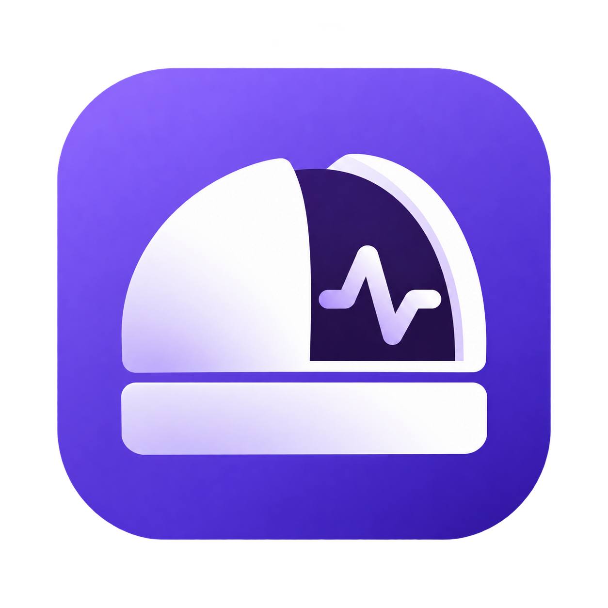
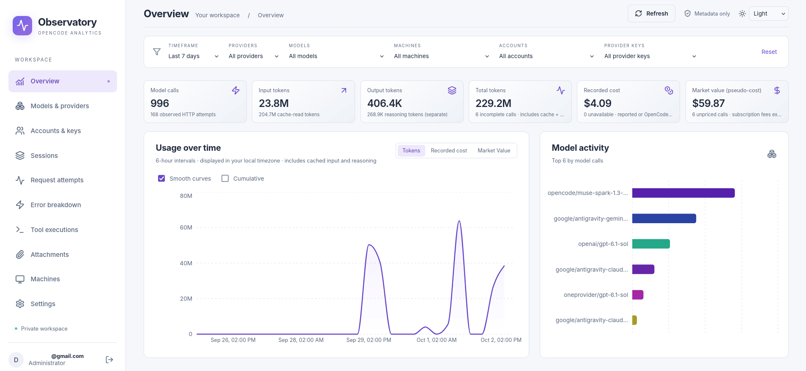

<p align="center">
  
</p>

# OpenCode Observatory

A private, self-hosted, metadata-only usage dashboard, telemetry collector, durable historical importer, and read-only Model Context Protocol (MCP) server for [OpenCode](https://opencode.ai).

Multiple machines and developers can share one private Observatory instance while retaining isolated, tenant-partitioned usage and credentials.

<p align="center">
  
</p>

---

## Key Capabilities

- **Zero Content Leakage:** Telemetry captures only metadata (token counts, models, latency, status, sanitized error categories, tool names, and byte counts). No prompt text, response content, reasoning output, code files, or provider API keys are ever transmitted.
- **Adaptive Visual Analytics:** Interactive charts for Tokens, Recorded Cost, and Market Value (API-rate equivalent). Intervals automatically scale from 1-hour up to calendar months. Features smooth monotone curves and cumulative progression toggles.
- **Accurate Token & Context Accounting:** Normalized token totals prevent double-counting across overlapping cache and reasoning fields. Dedicated **Context Reuse** metrics show token-weighted prompt cache hits, read/write volume, and estimated API savings.
- **Granular Identity & Provider Breakdown:** Hierarchical exploration across Providers, Accounts, and Keys. Accurately distinguishes OAuth sessions from API-key access and allows explicit historical attribution for unattributed legacy sessions.
- **Robust Offline Outbox:** Local SQLite outbox ensures transactional, acknowledged delivery. Telemetry never interrupts or slows down LLM inference streams.
- **In-Session OpenCode Integration:** Tools for real-time status inspection, usage querying, and interactive one-step setup directly inside OpenCode.
- **Modern Responsive Interface:** Built-in Light, Dark, and System theme synchronization (stored in localStorage without page flash), fine-grained output histograms, and two-decimal currency formatting.

---

## Quick Start (Docker Compose)

### Prerequisites
- Docker & Docker Compose (`docker compose` or `docker-compose`)
- Node.js 22+ and npm (for building frontend/server assets)
- Bun 1.3+ (for the plugin CLI and local tests)

### 1. Configure Environment & Persistence
Clone this repository and generate your local encryption and database credentials:

```sh
npm install
npm run build
npm run setup:env
```

`npm run setup:env` generates cryptographically random passwords and a 256-bit encryption key into `.env` (kept private and ignored by Git).

#### Automated Zero-Command Admin Setup
To have the server immediately operational upon launch without executing any manual commands, set your admin credentials in `.env`:

```dotenv
ADMIN_EMAIL=admin@example.com
ADMIN_PASSWORD=your-secure-password-min-12-chars
```

If these environment variables are set, the application container automatically provisions the initial administrator upon startup. If an administrator already exists in the database, these variables are safely ignored.

### 2. Launch Services
Start the PostgreSQL database and application:

```sh
docker compose up -d --build
```

- **Persistent Storage:** The PostgreSQL database is backed by the named Docker volume `pgdata` by default, preserving all telemetry, users, API keys, pricing overrides, and account assignments across restarts and updates. To use a custom host directory instead, set `PGDATA_SOURCE` in `.env` (e.g. `PGDATA_SOURCE=./data/postgres` or `PGDATA_SOURCE=/var/data/observatory`).
- **Port Bindings:**
  - **7692:** Web Dashboard & API (accessible on `http://localhost:7692` or your local network IP).
  - **7693:** PostgreSQL (bound strictly to `127.0.0.1` for local inspection or backups).

Open **http://localhost:7692** in your browser and sign in. Go to **Settings** to generate a Telemetry API Key (starts with `obs_`).

*(Optional: If you did not set `ADMIN_EMAIL` in `.env`, create the first administrator interactively with `docker compose exec -it app node --import tsx apps/server/src/admin.ts` or `npm run setup:admin`.)*

---

## Connect the OpenCode Plugin

Add the local plugin to your OpenCode configuration (`~/.config/opencode/opencode.json` or `opencode.jsonc`):

```jsonc
{
  "$schema": "https://opencode.ai/config.json",
  "plugin": [
    "/absolute/path/to/opencode-observatory/packages/plugin"
  ]
}
```

Restart OpenCode once so the plugin is loaded into the session.

### Option A: Configure Directly Inside OpenCode (No Terminal Commands)
Once the plugin is added, you can configure it directly inside your chat session with OpenCode:

Simply instruct the assistant:
> *"Connect to Observatory at http://localhost:7692 with key obs_..."*

The assistant uses the built-in `observatory_setup` tool to validate the server URL, verify your API key, save local configuration, and start live telemetry immediately without leaving your session.

### Option B: Configure via Terminal CLI
Alternatively, run the interactive terminal setup:

```sh
bun packages/plugin/dist/cli.js setup
```

Enter your Observatory server URL (default `http://localhost:7692`) and your `obs_...` telemetry API key.

---

## Query Statistics Inside OpenCode

### Built-in Plugin Tools
When configured with a read-capable key, the plugin exposes tools directly in OpenCode:
- `observatory_status`: Check local outbox delivery health and pending queue counts.
- `observatory_usage`: Query centralized usage, model breakdowns, and token statistics across any timeframe.
- `observatory_setup`: Inspect or update your Observatory connection on the fly.

### Model Context Protocol (MCP) Server
To expose the full read-only analytics suite as MCP tools to OpenCode or Claude Desktop, generate your configuration:

```sh
bun packages/plugin/dist/cli.js mcp-config
```

Merge the generated `mcp.observatory` block into your `opencode.json`. The endpoint operates over Streamable HTTP at `/mcp` with Bearer authentication.

Available MCP tools:
- `usage_summary`
- `usage_timeseries`
- `compare_models`
- `list_accounts`
- `list_machines`
- `list_sessions`
- `session_details`
- `request_attempts`
- `tool_executions`
- `error_breakdown`

---

## Historical Import & Offline Queue

### Importing Past Sessions
The historical importer reads OpenCode's local SQLite database (`opencode.db`) **read-only**, processes session snapshots, and enqueues sanitized metadata for delivery:

```sh
# Incremental import (picks up new/updated sessions)
bun packages/plugin/dist/cli.js import

# Full historical rescan
bun packages/plugin/dist/cli.js import --all
```

Imported data captures past session relationships, model steps, tool timings, token usages, and recorded errors. Because older sessions never recorded original account/key identities, Observatory labels them as `unassigned` and provides an **Account Assignments** interface to attribute known historical periods to specific accounts.

### Outbox Diagnostics & Replay
The local outbox database is located at `$XDG_DATA_HOME/opencode-observatory/outbox.db`.

```sh
bun packages/plugin/dist/cli.js status   # View pending/acknowledged queue count
bun packages/plugin/dist/cli.js flush    # Force immediate drain of pending events
bun packages/plugin/dist/cli.js replay   # Reset acknowledged state to replay history to a new server
```

---

## Architecture & Security

- **Row-Level Security (RLS):** Every database tenant query operates within a PostgreSQL transaction enforcing `user_id` row-level security. Database credentials used by the application cannot bypass RLS.
- **Token Normalization:** Automatically reconciles differences between provider-reported inclusive prompt counters and OpenCode's exclusive counters.
- **Fast Analytics:** Aggregations run through indexed lean facts passes with query-local JIT tuning and bounded tenant-isolated memory caches, delivering sub-100ms dashboard queries over thousands of canonical calls.
- **Reverse Proxy / LAN Deployment:** Set `PUBLIC_URL` in `.env` to your external URL (e.g. `http://192.168.1.148:7692` or `https://observatory.yourdomain.com`). This ensures secure cookie configuration and origin protection.

---

## Development & Verification

```sh
# Run typechecking across all workspaces
npm run typecheck

# Run unit tests
npm test

# Run PostgreSQL integration test suite
npm run test:integration

# Run isolated OpenCode provider smoke test
npm run test:opencode

# Run full browser end-to-end smoke test (Playwright)
npm run test:browser

# Run analytics performance benchmark against local database
npm run benchmark:analytics
```

---

## License

MIT
